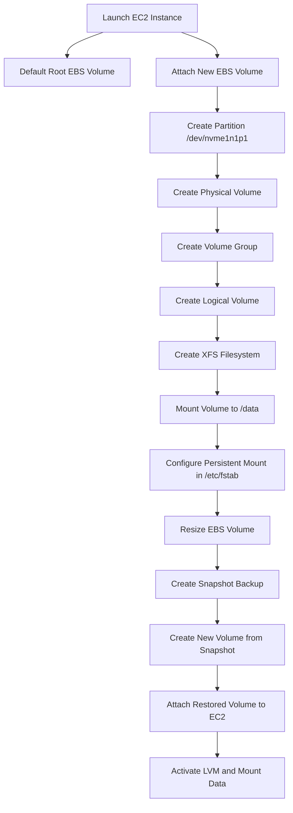

# EC2 Storage Management with LVM and Snapshots

## Project Overview

This project demonstrates how to manage persistent storage on an AWS EC2 instance using Amazon Elastic Block Store (EBS) and Linux Logical Volume Manager (LVM).

The workflow simulates real-world cloud infrastructure tasks performed by DevOps and Cloud Engineers such as:

- Attaching additional storage
- Partitioning disks
- Creating LVM volumes
- Mounting persistent storage
- Expanding storage capacity
- Creating EBS snapshots
- Restoring volumes from snapshots

---

## Architecture Diagram

> Add the generated architecture diagram image here.


---

## Workflow Flowchart



---

# Implementation Steps

## 1. Verify Attached Disks

```bash
lsblk
```

Example:

```
nvme0n1  -> root volume
nvme1n1  -> newly attached EBS volume
```

---

## 2. Create Partition

```bash
fdisk /dev/nvme1n1
```

Create:

```
/dev/nvme1n1p1
```

---

## 3. Install LVM

```bash
yum install lvm2 -y
```

---

## 4. Create LVM Structure

### Create Physical Volume

```bash
pvcreate /dev/nvme1n1p1
```

### Create Volume Group

```bash
vgcreate data_vg /dev/nvme1n1p1
```

### Create Logical Volume

```bash
lvcreate -L 1G -n data_lv data_vg
```

---

## 5. Create Filesystem

```bash
mkfs.xfs /dev/data_vg/data_lv
```

---

## 6. Mount Volume

```bash
mkdir /data
mount /dev/data_vg/data_lv /data
```

Verify mount:

```bash
df -h
```

---

## 7. Configure Persistent Mount

Edit fstab:

```bash
vim /etc/fstab
```

Add:

```
/dev/data_vg/data_lv   /data   xfs   defaults   0 0
```

---

## 8. Resize Storage

After increasing EBS size in AWS console:

```bash
pvresize /dev/nvme1n1p1
lvextend -l +100%FREE /dev/data_vg/data_lv
xfs_growfs /data
```

---

## 9. Snapshot and Restore Workflow

```
EBS Volume
     ↓
Create Snapshot
     ↓
Create New Volume from Snapshot
     ↓
Attach Volume to EC2
```

Activate LVM after attaching restored volume:

```bash
vgscan
vgchange -ay
```

---

# Key Concepts Learned

- AWS EC2 storage management
- Amazon EBS volume operations
- Linux disk partitioning
- Logical Volume Manager (LVM)
- Filesystem creation and mounting
- Persistent storage configuration
- Storage expansion without downtime
- Snapshot-based backup and recovery

---

# Skills Demonstrated

- AWS Cloud Infrastructure
- Linux System Administration
- Storage Management
- Logical Volume Manager (LVM)
- Backup and Recovery
- Cloud DevOps Fundamentals
